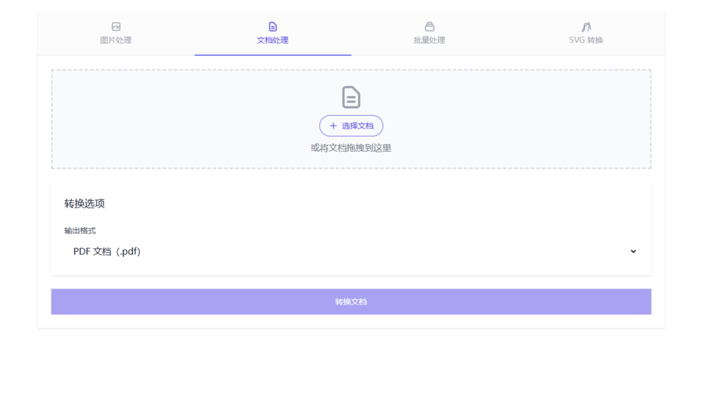
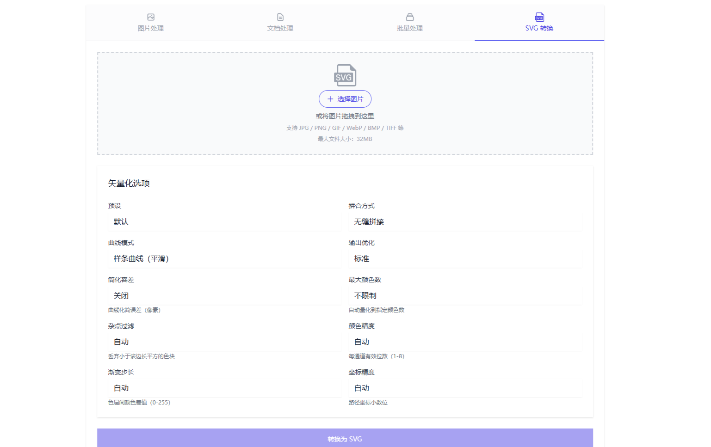

# Fan-Reubah - Universal File Converter & Image Processor

a simple web-based tool for processing images and converting documents with a simple interface

## Features

- [x] File Converter (Keep on adding more formats)
- [x] Dark Mode
- [x] Image → SVG Vectorization (Powered by VTracer)
- [x] Chinese/English Language Switcher (default Chinese, toggle in top navigation)
- [ ] API
- [ ] Background Removal for Images
  
## Quick Start

### 使用 systemd 安装（推荐）
一键安装为 systemd 服务（以 root 运行）：
```bash
git clone https://github.com/meimolihan/fan-reubah.git
cd fan-reubah
bash scripts/install.sh -y -p 8081
```
或远程一键安装（自动从 GitHub Release 下载二进制与前端资产）：
```bash
curl -fsSL https://raw.githubusercontent.com/meimolihan/fan-reubah/main/scripts/install.sh | bash -s -- -p 8081
```
访问地址：`http://<服务器IP>:8081`

#### 安装目录说明
默认应用目录为 `/var/lib/fan-reubah`（前端模板/静态资源部署于此，二进制固定安装在 `/usr/local/bin/fan-reubah`）。

- **交互式**（未指定 `-a` 且非 `-y` 时，会提示输入应用目录，直接回车使用默认值）：
```bash
bash scripts/install.sh -p 8081
```
- **免交互指定目录**（其余未指定项使用默认值）：
```bash
bash scripts/install.sh -p 8081 -a /var/lib/fan-reubah -y
```
- **远程管道免交互指定目录**：
```bash
curl -fsSL https://raw.githubusercontent.com/meimolihan/fan-reubah/main/scripts/install.sh | bash -s -- -p 8081 -a /var/lib/fan-reubah
```

安装记录写入 `/etc/fan-reubah.conf`，重装/升级会自动沿用上次的端口与应用目录。

常用 systemctl 命令：
```bash
systemctl status fan-reubah        # 查看状态
systemctl restart fan-reubah       # 重启服务
systemctl stop fan-reubah          # 停止服务
systemctl enable fan-reubah        # 开机自启
journalctl -u fan-reubah -f        # 跟随日志
journalctl -u fan-reubah -n 50     # 最近日志
```

### 卸载
停止并移除 systemd 服务、二进制（含 SVG 转换引擎 vtracer）、应用目录与安装记录，并撤销安装时开放的防火墙端口。

```bash
bash scripts/uninstall.sh                  # 交互确认卸载（默认保留应用目录）
bash scripts/uninstall.sh -y               # 免确认卸载（保留应用目录）
bash scripts/uninstall.sh -y --purge       # 免确认卸载并删除应用目录
```

或远程一键卸载（无需克隆仓库，以 root 运行）：
```bash
curl -fsSL https://raw.githubusercontent.com/meimolihan/fan-reubah/main/scripts/uninstall.sh | sudo bash -s -- -y --purge
```

| 参数 | 说明 |
| --- | --- |
| `-y` / `--yes` | 免确认，自动同意卸载 |
| `--purge` / `--delete-appdir` | 卸载时同时删除应用目录（模板与静态资源） |
| `--keep-appdir` | 保留应用目录（非交互模式下默认即保留） |
| `-q` / `--quiet` | 静默模式，仅输出关键信息 |

脚本会自动按 `/proc` 终止残留的 fan-reubah 进程，并关闭 install.sh 开放过的防火墙端口（firewalld/ufw/iptables）。

### Using Docker
```bash
git clone https://github.com/meimolihan/fan-reubah.git
cd fan-reubah
docker compose build --no-cache && docker compose up -d
```
or create a folder for the project and run
```bash
docker run -d --name fan-reubah -p 8081:8081 -v doc-temp:/tmp -e PORT=8081 --restart unless-stopped mobufan/fan-reubah:latest
```
Access at: `http://localhost:8081`

### Local Development
Requirements:
- Go 1.22+
- LibreOffice (for document conversion)
- GCC/G++ + libwebp/libheif 开发库
- Rust (cargo) — 可选，仅 SVG 矢量化功能需要，然后运行 `bash scripts/build-vtracer.sh`

```bash
go mod download
cd templates && npm install && npm run build && cd ..
go run cmd/server/main.go
```

### 构建与发布
构建前端产物与 Go 二进制（含 tag 与 GitHub Release）：
```bash
bash scripts/build-and-push.sh v1.0.0 --yes
```

## Images

Here are some images related to the project:





## Format Support & Compatibility

> **Matrix Guide:**
> - Find your source format in the left column
> - Follow the row to find available output formats
> - ✅ = Supported conversion
> - `-` = Same format (no conversion needed)

### Image Conversion Matrix

| From ➡️ To ⬇️ | JPG/JPEG | PNG | WebP | GIF | BMP | HEIC/HEIF | PDF |
|--------------|:---:|:---:|:----:|:---:|:---:|:---:| :---: |
| **JPG/JPEG** | -   | ✅  | ✅   | ✅  | ✅ | ❌ | ✅   |
| **PNG**      | ✅  | -   | ✅   | ✅  | ✅  | ❌ | ✅  |
| **WebP**     | ✅  | ✅  | -    | ✅  | ✅  | ❌ | ✅  |
| **GIF**      | ✅  | ✅  | ✅   | -   | ✅  | ❌ | ✅  |
| **BMP**      | ✅  | ✅  | ✅   | ✅  | -   | ❌| ✅   |
| **HEIC/HEIF**| ✅  | ✅  | ✅   | ✅  | ✅  | - | ✅   |

### Document Conversion Matrix

| From ➡️ To ⬇️ | PDF | DOCX | DOC | ODT | RTF | TXT |
|--------------|:---:|:----:|:---:|:---:|:---:|:---:|
| **PDF** (from PDF currently still bad)     | -   | ✅   | ✅  | ❌  | ❌  | ❌  |
| **DOCX**     | ✅  | -    | ✅  | ✅  | ✅  | ✅  |
| **DOC**      | ✅  | ✅   | -   | ✅  | ✅  | ✅  |
| **ODT**      | ✅  | ✅   | ✅  | -   | ✅  | ✅  |
| **RTF**      | ✅  | ✅   | ✅  | ✅  | -   | ✅  |
| **TXT**      | ✅  | ✅   | ✅  | ✅  | ✅  | -   |

### Additional Image Features

| Format | Background Removal (Soon) | Optimization | Batch Processing |
|--------|:-----------------:|:------------:|:---------------:|
| JPG/JPEG | ❌              | ✅           | ✅              |
| PNG    | ❌                | ❌           | ✅              |
| WebP   | ❌                | ❌           | ✅              |
| GIF    | ❌                | ❌           | ✅              |
| BMP    | ❌                | ❌           | ✅              |
| HEIC/HEIF | ❌             | ❌           | ✅              |

## Notes

- Isolated processing environment
- No file storage - immediate delivery
- Automatic cleanup
- Input validation

## License
This project is licensed under the [MIT License](LICENSE).